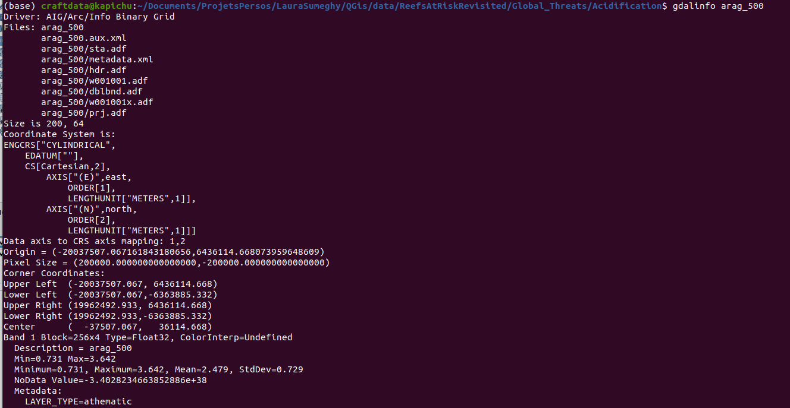
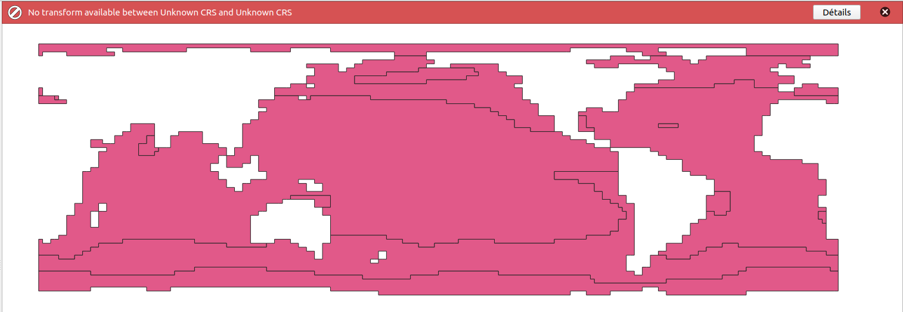

# Software
The software to use for this project is [QGis](https://www.qgis.org/fr/site/) and with Ubuntu it can be readily installed thanks to **Ubuntu Software**.

# Data sources

 - [Marine Protected Areas in Coral Reef Regions of the World](https://datasets.wri.org/dataset/marine-protected-areas-in-coral-reef-regions-of-the-world)
 - [Reefs at Risk Revisited: Climate-Related Threats Data](https://datasets.wri.org/dataset/reefs-at-risk-revisited)
 - [Reefs at Risk in the Caribbean](https://www.wri.org/research/reefs-risk-caribbean)
 - [Reefs at Risk Revisited](https://www.wri.org/research/reefs-risk-revisited)

Couche non valide: GDAL provider Cannot open GDAL dataset /home/craftdata/LauraSumeghy/QGis/data/ReefsAtRiskRevisitedClimate-RelatedThreatsData/reefsatriskrevisited2030.kmz: `/home/craftdata/LauraSumeghy/QGis/data/ReefsAtRiskRevisitedClimate-RelatedThreatsData/reefsatriskrevisited2030.kmz' not recognized as a supported file format. Raster layer Le fournisseur de données n'est pas valide (prestataire : gdal, URI : /home/craftdata/LauraSumeghy/QGis/data/ReefsAtRiskRevisitedClimate-RelatedThreatsData/reefsatriskrevisited2030.kmz

# Issues
After a meeting with Laulau, I have more clues about the files and directories of interest.

File of interest:
 - .adf
 - .adj
 - .aux
 - .lyr

Directories of interest:
 - ReefsAtRiskInTheCaribbean/Lambert
 - ReefsAtRiskRevisited/Global_Threats/Acidification
 - ReefsAtRiskRevisited/Global_Threats/Future_Thermal_Stress

# Proposed solutions

## Fix for .lyr files
The proposed fixes essentially come from the [SLYR Community Edition](https://plugins.qgis.org/planet/tag/lyr/) plugin for which I got a [full tutorial on YouTube](https://www.youtube.com/watch?v=mpdw-gXm7KI).  
The plugin serves the purpose to convert the proprietary **.lyr** format into a QGis-compatible format that is **.qml**.

## Fix for .aux files
According to the [QGIS StackExchange forum](https://gis.stackexchange.com/questions/62857/how-to-open-aux-file-in-qgis), **.aux** files are auxiliary files in ArcGIS that contain additional information related to a Raster file. So, to fix this one I'd first find a raster file to work on. But that doesn't look easy, I don't recognize any of these file extensions...  
Okay I got it!! According to the [gis documentation on the adf file format](https://docs.fileformat.com/gis/adf/), adf files are raster data file format. So, this one should be fixed by fixing the loading of the adf files. Sounds easy to me. :sob:

## Fix for .adf files
About the .adf files, it seems the raster data file is the whole folder. **All the files (adf plus metadata.xml) build up the whole set**. ([source 1](https://docs.fileformat.com/gis/adf/), [source 2](https://gis.stackexchange.com/questions/459879/converting-esri-grid-format-adf-files-to-geotiff-using-python-and-arcpy))  
Then, the folder has to be considered as a whole and converted to a shapefile **.shp**. For a grid coverage, that can be done via the GDAL package ([source 3 - forum](https://gis.stackexchange.com/questions/19047/how-to-convert-coverage-adf-to-shapefile)). Here is the [full doc of GDAL](https://gdal.org/index.html).  
Basically, to ensure you are dealing with a grid coverage, you should `gdalinfo <name-of-the-folder>`. If it fails then it is a vector coverage.  
After, if you want to convert a grid coverage to a shapefile you can use [gdal_polygonize](https://gdal.org/programs/gdal_polygonize.html). For instance `gdal_polygonize.py arag_500 arag500Test`, and it creates a series of files in the directory **arag500Test** that is created on the fly.   

The **.shp** file can then be loaded in QGIS, but it happens to display an error about the CRS. It might be possible to fix this error message 'just' by [saving a custom CRS into QGIS](https://gis.stackexchange.com/questions/358247/trouble-changing-unknown-crs-of-vector-layer-in-qgis)...

## Fix for .adj files

Couche non valide: GDAL provider Cannot open GDAL dataset /home/craftdata/Documents/ProjetsPersos/LauraSumeghy/QGis/data/ReefsAtRiskRevisited/Global_Threats/Acidification/arag500Test/out.shp: `/home/craftdata/Documents/ProjetsPersos/LauraSumeghy/QGis/data/ReefsAtRiskRevisited/Global_Threats/Acidification/arag500Test/out.shp' not recognized as a supported file format. Raster layer Le fournisseur de données n'est pas valide (prestataire : gdal, URI : /home/craftdata/Documents/ProjetsPersos/LauraSumeghy/QGis/data/ReefsAtRiskRevisited/Global_Threats/Acidification/arag500Test/out.shp

